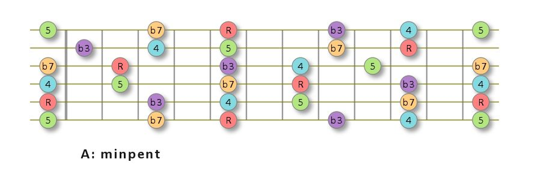

# GuitarDiagz
Guitar Fretboard Diagrams

-------------------------------------------------------------------------

If you play guitar and use Paint Shop Pro, you might be interested in 
downloading my fretboard drawing tool.  It's completely free and you are 
welcome to modify it in any way to meet your needs.

I have drawn hundreds of grids on paper and with various drawing programs to 
learn scales.  My favorite drawing program is Paint Shop Pro.  Compared to 
the other drawing programs, it is cheap and has some good features.  So, it's 
not hard to see why I would draw fretboards with this program.

One of it's best features is a Python script engine.  This means that 
you can automate quite sophisticated drawings.

I started using this feature to curve fit catalog data charts.

The other day, I decided to automate a fretboard drawing.  It started with a 
simple fret and string grid.  The idea was to make a common grid for drawing 
my practice charts.  But, it grew very quickly into an almost complete tool.

The script starts out by asking for a root note, a scale type and the note 
label kind.  

It then creates a new drawing file and draws the draws a colour coded drawing 
of the scale.

Here is an example of the kind of drawing it creates...

Get the source code right here and load it into your PSP scripts folder.

If you have any good ideas to improve the code or you make improvements, 
please pass me an update.

